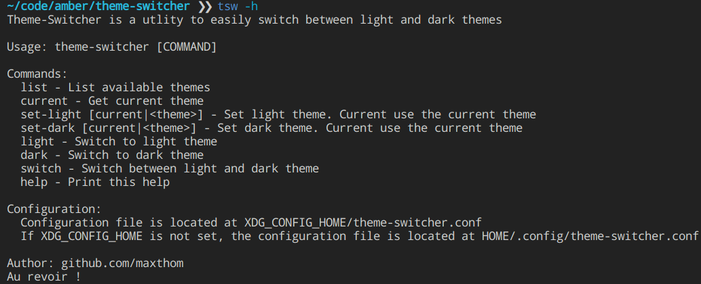

# Theme-Switcher

Theme-Switcher is a utility to easily switch between light and dark theme

## Goal

The two main goals are

1. To try out the new [AmberLang](https://github.com/Ph0enixKM/Amber)
2. Creating this little utility for my personnal used


## Installation

```sh
# Move theme=switcher.sh to /usr/local/bin/tsw
# Use !
```

## Usage

Configure light and dark theme to then be easily able to switch

```sh
# See list of available themes
tsw list
# Set light theme
tsw set-light [current|<theme>]
# Set dark theme
tsw set-dark [current|<theme>]
# Easily switch between light and dark theme
tsw switch
# Show help
tsw help
```



